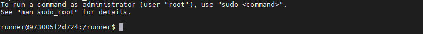

# Your First Run With horse2zebra Dataset


## For Docker Install
If you haven't already, please follow the installation using [Docker](../installation.md#docker)


#### Data download
The horse2zebra dataset can be downloaded to the `<data_dir>` in the host system using instructions below,
1. Open a terminal inside the cloned repository and run, 

```console
cd projects/horse2zebra
bash download_cyclegan_dataset.sh horse2zebra <data_dir>
```

### Training
Next, the following commands are to be run in the docker container shell 



Run the training using,

```console
cd /code
python tools/train.py config=projects/horse2zebra/experiments/default_docker.yaml
```

NOTE: If you have more than one GPU, then you can either run the training in distributed mode or [set CUDA_VISIBLE_DEVICES environment variable](https://developer.nvidia.com/blog/cuda-pro-tip-control-gpu-visibility-cuda_visible_devices/) to use only single GPUs.